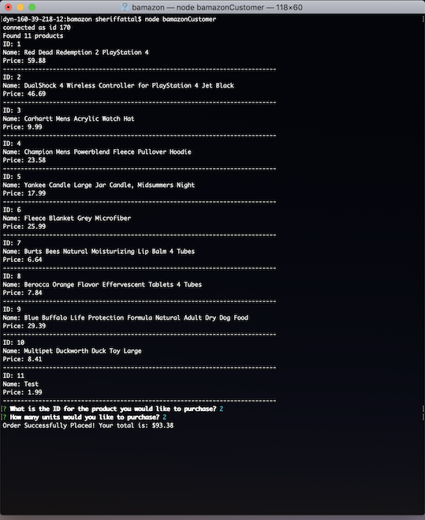
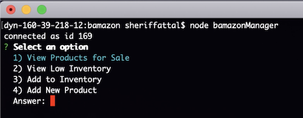
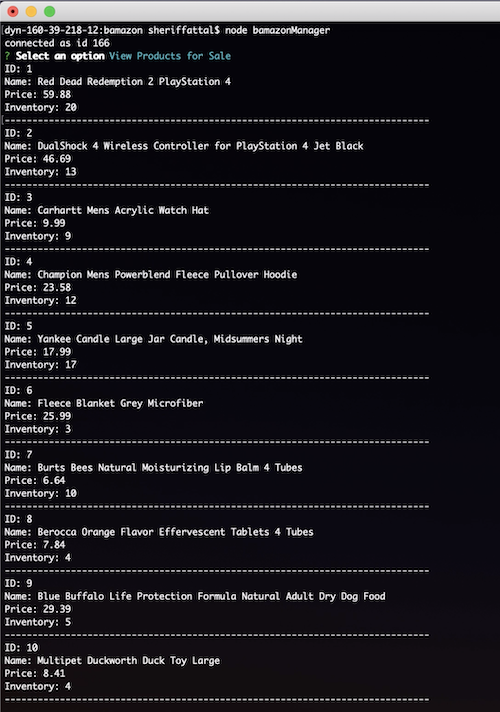
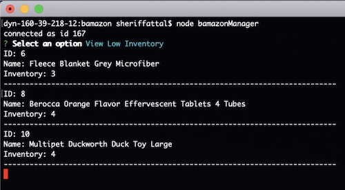
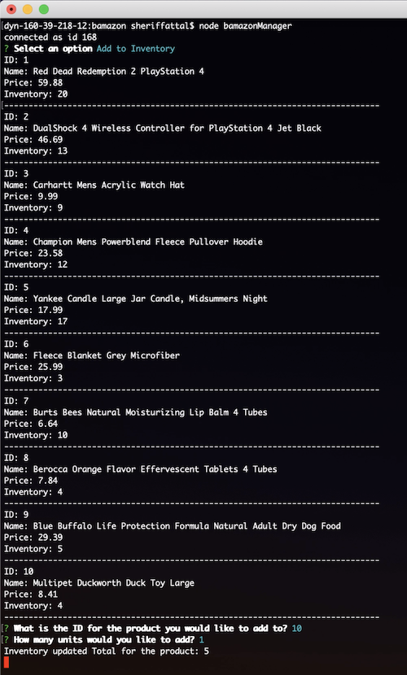
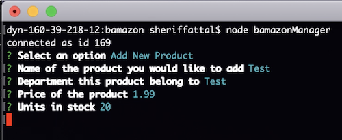
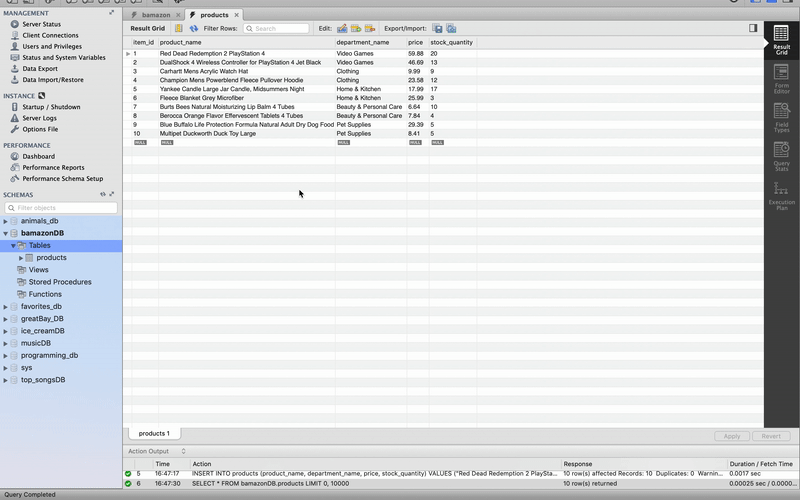

# bamazon

## Instructions

- Amazon-like storefront made with the MySQL. 
- The customer app takes in orders from customers and depletes stock from the store's inventory.
- The manager app checks on low inventory, replenishes stock, and adds new products.

---

## Functionality

### Customer View
*run using:* `node bamazonCustomer`

### Manager View
*run using:* `node bamazonManager`

*View Products for Sale:*

*View Low Inventory (less than 5):*

*Add to Inventory:*

*Add New Product:*

